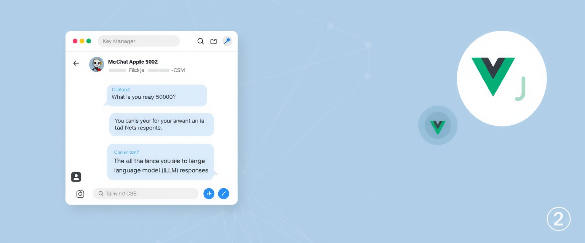
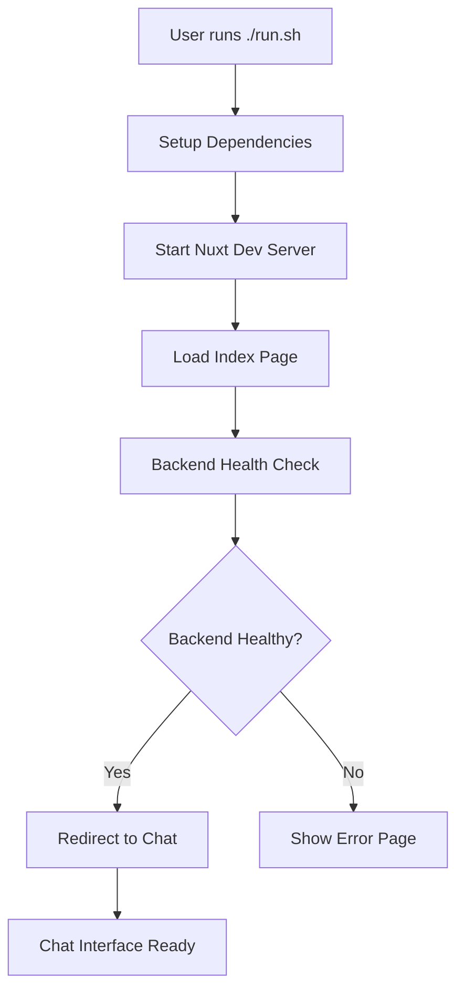
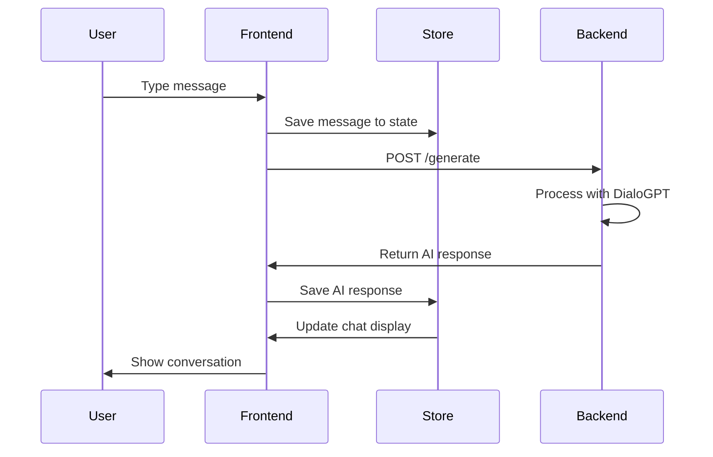

# Mental Health Chatbot Frontend

A Nuxt.js frontend for the Mental Health Chatbot Application that interacts with the Flask backend.



NOTE : [Backend Repository](https://github.com/punnoose-1620/mental-health-chatbot-backend)

## 🚀 Quick Start

**Get the application running with one command:**

```bash
./run.sh
```

This will automatically:
1. ✅ Install Node.js and dependencies (if needed)
2. 🚀 Start the development server on http://localhost:3000
3. 🌐 Open your browser to the running application

### Alternative Options

```bash
# Run without opening browser
./run.sh --no-browser

# Show help
./run.sh --help

# Just setup dependencies
./setup.sh
```

## 📋 Requirements

- **Operating System**: Linux, macOS, or Windows
- **Node.js**: Version 14 or higher (automatically installed if missing)
- **Internet Connection**: For downloading dependencies

## 🔧 Frontend Architecture & Technology Stack

### **Core Technologies**
- **Framework**: [Nuxt.js v2.15.8](https://v2.nuxt.com/) - Vue.js meta-framework for server-side rendering
- **JavaScript Framework**: Vue.js 2.7.10 - Progressive JavaScript framework
- **Styling**: Tailwind CSS v5.3.3 - Utility-first CSS framework
- **HTTP Client**: Axios v1.1.2 - Promise-based HTTP client
- **Build System**: Webpack (via Nuxt.js) - Module bundler and development server

### **Application Flow & Working**

#### **1. 🚀 Application Startup**


#### **2. 🔍 Health Check Process**
When the application starts:
1. **Loading Screen Display**: Index page (`pages/index.vue`) shows loading animation
2. **Backend Health Check**: Sends `GET /health` request to Flask backend (default: `http://localhost:5000`)
3. **Response Evaluation**:
   - ✅ **Success** (200 OK): Backend is healthy → Redirect to `/chat`
   - ❌ **Failure** (Network/Server Error): Backend unavailable → Redirect to `/error`
4. **Automatic Retry**: Failed requests retry up to 3 times with exponential backoff

#### **3. 💬 Chat Interface Operation**


#### **4. 🛠️ State Management**
- **Vuex Store**: Manages application state including:
  - Chat messages array (user + AI responses)
  - Backend connection status
  - Loading states and error handling
  - User preferences and chat history

#### **5. 📱 Responsive Design**
- **Mobile-First**: Tailwind CSS ensures mobile compatibility
- **Adaptive Layout**: Chat interface adjusts to screen size
- **Touch-Friendly**: Optimized for mobile touch interactions

### **Key Components Architecture**

#### **Pages Structure**
```
pages/
├── index.vue          # Loading & health check page
├── chat.vue           # Main chat interface
├── error.vue          # Backend unavailable page
└── _error.vue         # 404 and other errors
```

#### **API Integration (`plugins/api.js`)**
```javascript
// Axios configuration with interceptors
- Base URL: process.env.BASE_URL || 'http://localhost:5000'
- Timeout: 10 seconds
- Retry Logic: 3 attempts with exponential backoff
- Error Handling: Automatic error logging and user feedback
```

#### **Environment Configuration**
```bash
# Backend Integration
BASE_URL=http://localhost:5000
API_TIMEOUT=10000
RETRY_ATTEMPTS=3

# Chat Settings  
DEFAULT_MAX_LENGTH=150
DEFAULT_TEMPERATURE=0.7

# UI Customization
APP_NAME="Mental Health Chatbot"
THEME_COLOR="#4F46E5"
```

### **Development & Build Process**

#### **Development Mode**
```bash
npm run dev  # Hot reload on http://localhost:3000
```
- **Hot Module Replacement**: Instant updates without page refresh
- **DevTools Integration**: Vue DevTools support for debugging
- **Source Maps**: Easy debugging with original source code

#### **Production Build**
```bash
npm run build && npm run start
```
- **Code Splitting**: Automatic route-based code splitting
- **Minification**: JavaScript and CSS optimization
- **Tree Shaking**: Removes unused code for smaller bundle size

### **Cross-Platform Compatibility**

#### **Browser Support**
- ✅ Chrome 60+, Firefox 55+, Safari 12+, Edge 79+
- ✅ Mobile browsers (iOS Safari, Chrome Mobile)
- ✅ Progressive Web App (PWA) ready

#### **Operating System Support**
- ✅ **Linux**: Ubuntu, Debian, CentOS, Arch Linux
- ✅ **macOS**: 10.15+ with automatic Homebrew setup
- ✅ **Windows**: 10+ with manual Node.js guidance

### **Technology References**
- **Nuxt.js Documentation**: [https://v2.nuxt.com/](https://v2.nuxt.com/)
- **Vue.js Guide**: [https://v2.vuejs.org/v2/guide/](https://v2.vuejs.org/v2/guide/)
- **Tailwind CSS**: [https://tailwindcss.com/docs](https://tailwindcss.com/docs)
- **Axios Documentation**: [https://axios-http.com/docs/intro](https://axios-http.com/docs/intro)

## Features

- **Loading Screen**: Checks backend health and redirects accordingly
- **Chat Interface**: Simple and intuitive chat UI for communicating with the LLM
- **Error Handling**: Displays error page when backend is unavailable
- **Responsive Design**: Works on desktop and mobile devices
- **Automated Setup**: One-command installation and deployment

## 🛠️ Setup Options

### Option 1: Automated Setup (Recommended)

The easiest way to get started:

```bash
# Make script executable (if needed)
chmod +x run.sh

# Run the complete setup and start the application
./run.sh
```

### Option 2: Step-by-Step Setup

If you prefer manual control:

1. **Install dependencies:**
   ```bash
   ./setup.sh
   ```

2. **Configure environment variables (optional):**
   ```bash
   cp .env.example .env
   # Edit .env file with your preferred settings
   ```

3. **Start development server:**
   ```bash
   npm run dev
   ```

4. **Open browser manually:**
   ```
   http://localhost:3000
   ```

### Option 3: Manual Setup

Traditional npm-based setup:

1. **Install Node.js 14+** from [nodejs.org](https://nodejs.org/)

2. **Install dependencies:**
   ```bash
   npm install
   ```

3. **Configure environment variables:**
   ```bash
   cp .env.example .env
   ```

4. **Run the development server:**
   ```bash
   npm run dev
   ```

## 🚀 Running the Application

### Development Mode
```bash
npm run dev          # Start on http://localhost:3000
```

### Production Mode
```bash
npm run build        # Build for production
npm run start        # Start production server
```

### Static Generation
```bash
npm run generate     # Generate static files
```

## 🖥️ Supported Operating Systems

### Automatic Setup Support
- **Ubuntu/Debian** - Uses apt-get with NodeSource repository
- **CentOS/RHEL** - Uses yum with NodeSource repository  
- **Arch Linux** - Uses pacman package manager
- **macOS** - Uses Homebrew (installs if not present)
- **Windows** - Provides manual installation guidance

### Browser Opening Support
- **Linux** - xdg-open, gnome-open, Firefox, Chrome
- **macOS** - Native `open` command
- **Windows** - `start` command

## Environment Variables

The application uses the following environment variables:

### Backend Configuration
- `BASE_URL`: URL of the backend API (default: http://localhost:5000)

### App Environment
- `NODE_ENV`: Application environment (development/production)

### Chat Configuration
- `DEFAULT_MAX_LENGTH`: Default maximum length for generated text (default: 150)
- `DEFAULT_TEMPERATURE`: Default temperature for text generation (default: 0.7)

### UI Configuration
- `APP_NAME`: Application name displayed in UI and browser title
- `APP_DESCRIPTION`: Application description for meta tags
- `THEME_COLOR`: Primary theme color (used for browser theme-color)

### API Configuration
- `API_TIMEOUT`: Timeout for API requests in milliseconds (default: 10000)
- `RETRY_ATTEMPTS`: Number of retry attempts for failed requests (default: 3)

## Architecture

- **API Plugin**: Handles communication with the Flask backend
- **Store**: Manages application state including messages and backend status
- **Pages**:
  - Index: Loading screen that checks backend health
  - Chat: Main chat interface
  - Error: Displayed when backend is unavailable

## 🔧 Troubleshooting

### Common Issues

**Script Permission Error**
```bash
chmod +x run.sh setup.sh
```

**Port 3000 Already in Use**
- The script will detect if the server is already running
- Kill existing processes: `pkill -f "nuxt"`

**Setup Fails**
- Check internet connection
- Ensure you have admin/sudo privileges
- Try manual setup: `npm install`

**Browser Doesn't Open**
- Manually navigate to: http://localhost:3000
- Use `./run.sh --no-browser` option

**Dependencies Issues**
```bash
# Clear npm cache and reinstall
npm cache clean --force
rm -rf node_modules package-lock.json
./setup.sh
```

### Getting Help

For additional support:
1. Check error messages for specific issues
2. Verify Node.js version: `node --version` (should be 14+)
3. Check if backend is running (if needed)
4. Try running steps manually

## 📁 Project Files

- `run.sh` - Complete automation script (setup + start + browser)
- `setup.sh` - Dependency installation script
- `package.json` - Project dependencies and scripts
- `RUN_README.md` - Quick start guide
- `SETUP_README.md` - Detailed setup documentation

## Backend Integration

This frontend is designed to work with the Flask backend that exposes:

- `GET /health`: Health check endpoint
- `POST /generate`: LLM text generation endpoint

Make sure the backend is running before starting the frontend.

## 🛠️ Technologies Used

- **Frontend Framework**: Nuxt.js
- **JavaScript Framework**: Vue.js
- **Styling**: Tailwind CSS
- **HTTP Client**: Axios
- **Automation**: Bash scripts for cross-platform setup

---

## 🎯 Quick Commands Reference

```bash
# One-command start (recommended)
./run.sh

# Setup only
./setup.sh

# Development server
npm run dev

# Production build
npm run build && npm run start

# Help
./run.sh --help
```

**Ready to start?** Run `./run.sh` and you'll be up and running in minutes! 🎉
